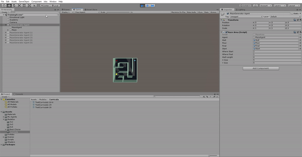
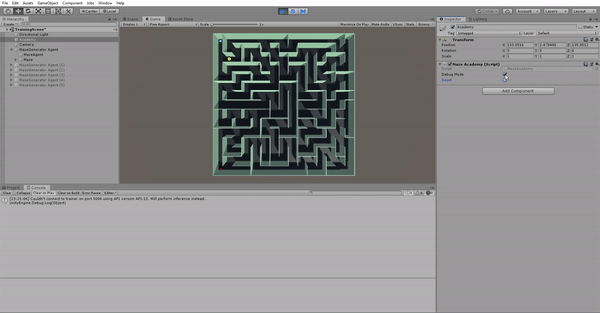
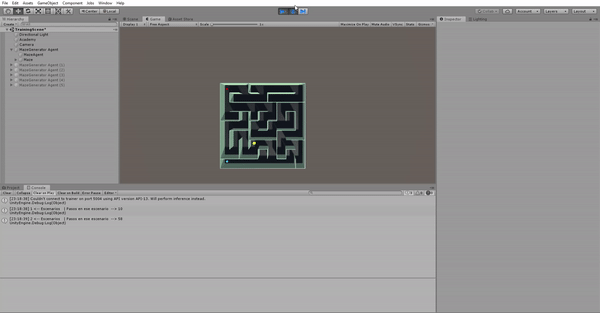

# Deep Learning en Videojuegos: Resolución de Laberintos
## Trabajo de Fin de Grado 2019-2020
### Autor: Pablo Martin Gonzalez

### Abstract

### GIFS del comportamiento

#### PPO

Aqui se puede apreciar el comportamiento de un modelo entrenado sesetan y cinco horas bajo una red neuronal PPO.

#### LSTM

Por el otro lado aqui se puede ver como un moidelo entrenado treinta horas en una red neuronal LSTM es capaz de resolver laberintos de quince por quince.

Es apreciable que los modelos se repiten, intentado acudir por el mismo camino varias veces, hasta que por fin cambian el comportamiento y alcanzan la salida

Y que en escenarios pequeños son capaces de resolver el problema de manera rapida

